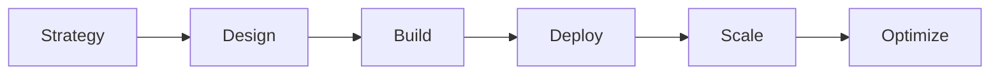

# Dypsis AI

> Turning AI innovation into measurable business results

## Overview

Dypsis AI exists to help ambitious enterprises unlock the full potential of artificial intelligence. We believe AI should not be a buzzword or an experiment: it should be a **trusted driver of business transformation**.

We design AI systems that are tailored to each organization's strategy, data, and industry context. From building roadmaps to deploying generative AI workflows, from enabling federated learning to scaling enterprise AI infrastructure, our work turns innovation into measurable results.

## What We Build

```
├── AI Strategy & Roadmaps
│   └── e.g., AI maturity assessment, use case prioritization, ROI modeling
├── Generative AI Workflows
│   └── e.g., RAG systems, AI assistants, document intelligence, code generation
├── Machine Learning Solutions
│   └── e.g., predictive analytics, anomaly detection, recommendation engines, forecasting
├── Federated Learning Systems
│   └── e.g., privacy-preserving ML, cross-organizational learning, distributed training
├── Enterprise AI Infrastructure
│   └── e.g., MLOps platforms, model serving, vector databases, observability
└── Custom AI Solutions
    └── e.g., computer vision, NLP pipelines, intelligent automation, decision support systems
```

### Core Capabilities

- **🎯 Strategic AI Implementation** - Translating business objectives into actionable AI architectures
- **⚙️ Production-Grade Systems** - Building scalable, secure, and maintainable AI infrastructure
- **🔐 Enterprise Security** - Security, explainability, and governance embedded by default
- **📊 Data Engineering** - Architecting data pipelines optimized for AI workloads
- **🚀 AI Operations** - End-to-end MLOps and model lifecycle management

## Our Approach

As a boutique consultancy, we partner directly with leadership teams, ensuring every solution is guided by senior expertise and grounded in outcomes.



**Principles that guide our work:**
- Security, explainability, and governance by default
- Senior expertise on every engagement
- Measurable outcomes over theoretical models
- Industry-specific context and compliance
- Sustainable and responsible AI scaling

## Impact

Organizations partnering with Dypsis.ai achieve:

- ⬇️ **Reduced operational costs** through intelligent automation
- ⚡ **Accelerated decision cycles** with AI-powered insights
- 🏆 **Sustainable competitive advantage** via proprietary AI capabilities

## Technology Stack

We work across the modern AI ecosystem:

**Frameworks & Tools**
```
Python | PyTorch | TensorFlow | LangChain | LiteLLM | vLLM | SGLang |
Hugging Face | OpenAI | Anthropic | Azure OpenAI
```

**Infrastructure & MLOps**
```
Kubernetes | Docker | MLflow | Weights & Biases | gpustack |
Ray | Airflow | Kubeflow | Azure ML | AWS SageMaker
```

**Data & Vector Stores**
```
PostgreSQL+vectorchord | Redis | Weaviate | Qdrant | ChromaDB
```

## Open Source

We believe in contributing back to the community. Check out our repositories for tools, frameworks, and reference implementations that showcase enterprise AI patterns and best practices.

## Get in Touch

Ready to transform your enterprise with AI you can trust?

- 🌐 **Website:** [dypsis.ai](https://dypsis.ai)
- 📧 **Email:** frederico.vicente[at]dypsis.ai
- 💼 **Partnership:** Direct engagement with senior AI consultants

---

<div align="center">

**Dypsis.ai**: *Dream bigger. Move faster. Build the future with AI you can trust.*

[](https://dypsis.ai)
[]()
[]()

</div>
